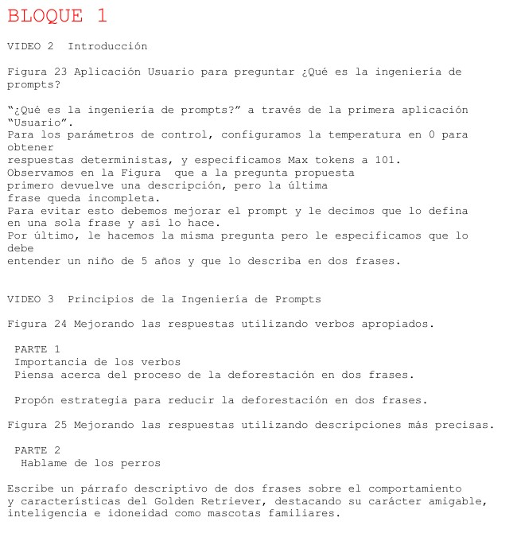

# Comentarios adicionales 

## Primer comentario

Estoy preparando la defensa segundo intento del día 4 de julio. Tal y como se ve en la Figura \@ref(fig:CURSO-4000). 

(\#fig:CURSO-4000)Ejemplo para la defensa segundo intento.

## Segundo comentario

Voy a introducir un video segundo intento: 

<h3 style="font-weight: bold; text-align: center;">Video Tutorial: Introducción a bookdown segundo intento</h3>
  <iframe width="500" height="400" src="https://www.youtube-nocookie.com/embed/99pZ5tndpX8?rel=0" frameborder="0" allow="accelerometer; autoplay; encrypted-media; gyroscope; picture-in-picture" allowfullscreen></iframe>

Aqui acaban mis comentarios del segundo intento.

